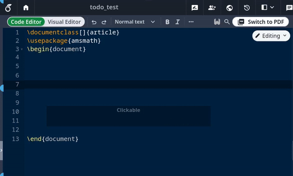

# Snippetleaf ``

A port of [Obsidian Latex Suite](https://github.com/artisticat1/obsidian-latex-suite) to overleaf that aims to make typesetting LaTeX math as fast as handwriting.

Inspired by [Gilles Castel&#39;s setup using UltiSnips](https://castel.dev/post/lecture-notes-1/).



The plugin's main feature is **snippets**, which help you write LaTeX quicker through shortcuts and text expansion! For example, type

-   "sqx" instead of "\sqrt{x}"
-   "a/b" instead of "\frac{a}{b}"
-   "par x y " instead of "\frac{\partial x}{\partial y}"

See [Gilles Castel&#39;s writeup](https://castel.dev/post/lecture-notes-1/) for more information.

The plugin comes with a [set of default snippets](https://github.com/superle3/snippet-leaf/blob/main/src/default_snippets.js), loosely based on [Gilles Castel&#39;s](https://castel.dev/post/lecture-notes-1/#other-snippets). You can modify them, remove them, and write your own.

## Usage

To get started, type "dm" to enter display math mode. Try typing the following:

-   "xsr" → "x^{2}".
-   "x/y `<kbd>`Tab`</kbd>`" → "\\frac{x}{y}".
-   "sin @t" → "\\sin \\theta".

**Have a look at the [cheatsheet](#cheatsheet)** for a list of commonly used default snippets.

Once these feel familiar, you can check out the [**default snippets**](https://github.com/artisticat1/obsidian-latex-suite/blob/main/src/default_snippets.js) for more commands. e.g.

-   "par `<kbd>`Tab`</kbd>` f `<kbd>`Tab`</kbd>` x `<kbd>`Tab`</kbd>`" → "\\frac{\\partial f}{\\partial x}".
-   "dint `<kbd>`Tab`</kbd>` 2pi `<kbd>`Tab`</kbd>` sin @t `<kbd>`Tab`</kbd>` @t `<kbd>`Tab`</kbd>`" → "\\int\_{0}^{2\pi} \\sin \\theta \\, d\\theta".

You can also add your own snippets! [For more info on writing snippets, see **here**](#snippets). You can [view snippets written by others and share your own snippets here](https://github.com/artisticat1/obsidian-latex-suite/discussions/50).

Aside from snippets, the plugin also comes with several other features that aim to make writing LaTeX easier.

## Features

### Auto-fraction

Lets you type "1/x" instead of "\frac{1}{x}".

For example, it makes the following expansions:

-   `x/` → `\frac{x}{}`
-   `(a + b(c + d))/` → `\frac{a + b(c + d)}{}`

and moves the cursor inside the brackets.

Once done typing the denominator, press `<kbd>`Tab`</kbd>` to exit the fraction.


### Matrix shortcuts

While inside a matrix, array, align, or cases environment,

-   Pressing `<kbd>`Tab`</kbd>` will insert the "&" symbol.
-   Pressing `<kbd>`Enter`</kbd>` will insert "\\\\" and move to a new line.
-   Pressing `<kbd>`Shift + Enter`</kbd>` will move to the end of the next line (which you can use to exit the matrix).


### Tabout

To make it easier to navigate and exit equations,

-   Pressing `<kbd>`Tab`</kbd>` while the cursor is at the end of an equation will move the cursor outside the `$` symbols.
-   Otherwise, pressing `<kbd>`Tab`</kbd>` will advance the cursor to the next closing bracket: `)`, `]`, `}`, `>`, or `|`.

### Visual snippets

Sometimes you want to annotate math, or cancel or cross out terms. Selecting some math with the cursor and typing

-   "U" will surround it with "\\underbrace".
-   "O" will surround it with "\\overbrace".
-   "C" will surround it with "\\cancel".
-   "K" will surround it with "\\cancelto".
-   "B" will surround it with "\\underset".


### Auto-enlarge brackets

When a snippet containing "\\sum", "\\int" or "\\frac" is triggered, any enclosing brackets will automatically be enlarged with "\\left" and "\\right".


### Snippets

_Snippets_ are shortcuts that allow you to insert certain text based on certain triggers. For example, the default snippet

```typescript
{trigger: "@l", replacement: "\\lambda", options: "mA"}
```

will expand "@l" to "\lambda".

Snippets can be edited in the plugin settings. The structure of a snippet is as follows:

```typescript
{
  trigger: string | RegExp,
  replacement: string,
  options: string,
  priority?: number,
  description?: string,
  flags?: string,
}
```

-   `trigger` : The text that triggers this snippet.
    -   Triggers can also be regular expressions. [See here for more info.](./DOCS.md#regex-snippets)
-   `replacement` : The text to replace the `trigger` with.
    -   Replacements can also be JavaScript functions. [See here for more info.](./DOCS.md#function-snippets)
-   `options` : See below.
-   `priority` (optional): This snippet's priority. Snippets with higher priority are run first. Can be negative. Defaults to 0.
-   `description` (optional): A description for this snippet.
-   `flags` (optional): Flags for regex snippets.

#### Options

-   `t` : Text mode. Only run this snippet outside math
-   `m` : Math mode. Only run this snippet inside math. Shorthand for both `M` and `n`
-   `M` : Block math mode. Only run this snippet inside a `$$ ... $$` block
-   `n` : Inline math mode. Only run this snippet inside a `$ ... $` block
-   `A` : Auto. Expand this snippet as soon as the trigger is typed. If omitted, the `<kbd>`Tab`</kbd>` key must be pressed to expand the snippet
-   `r` : [Regex](./DOCS.md#regex-snippets). The `trigger` will be treated as a regular expression
-   `v` : [Visual](./DOCS.md#visual-snippets). Only run this snippet on a selection. The trigger should be a single character
-   `w` : Word boundary. Only run this snippet when the trigger is preceded (and followed by) a word delimiter, such as `.`, `,`, or `-`.
-   `c` : Code mode. Only run this snippet inside a ` ``` ... ``` ` block

Insert **tabstops** for the cursor to jump to by writing "$0", "$1", etc. in the `replacement`.

For examples and more details on writing snippets, including **regex** snippets and **function** snippets, [have a look at the **documentation**](DOCS.md).

You can [view snippets written by others and share your own snippets here](https://github.com/artisticat1/obsidian-latex-suite/discussions/50).

> [!WARNING]
> Snippet files are interpreted as JavaScript and can execute arbitrary code.
> Always be careful with snippets shared from others to avoid running malicious code.

## Cheatsheet

| Trigger               | Replacement        |
| --------------------- | ------------------ |
| mk                    | \$ \$              |
| dm                    | \$\$`<br><br>`\$\$ |
| sr                    | ^{2}               |
| cb                    | ^{3}               |
| rd                    | ^{ }               |
| \_                    | \_{ }              |
| sq                    | \\sqrt{ }          |
| x/y`<kbd>`Tab`</kbd>` | \\frac{x}{y}       |
| //                    | \\frac{ }{ }       |
| "                     | \\text{ }          |
| text                  | \\text{ }          |
| x1                    | x\_{1}             |
| x,.                   | \\mathbf{x}        |
| x.,                   | \\mathbf{x}        |
| xdot                  | \\dot{x}           |
| xhat                  | \\hat{x}           |
| xbar                  | \\bar{x}           |
| xvec                  | \\vec{x}           |
| xtilde                | \\tilde{x}         |
| xund                  | \\underline{x}     |
| ee                    | e^{ }              |
| invs                  | ^{-1}              |

When running a snippet that **moves the cursor inside brackets {}, press `<kbd>`Tab`</kbd>` to exit the brackets**.

### Greek letters

| Trigger | Replacement  | Trigger | Replacement |
| ------- | ------------ | ------- | ----------- |
| @a      | \\alpha      | eta     | \\eta       |
| @b      | \\beta       | mu      | \\mu        |
| @g      | \\gamma      | nu      | \\nu        |
| @G      | \\Gamma      | xi      | \\xi        |
| @d      | \\delta      | Xi      | \\Xi        |
| @D      | \\Delta      | pi      | \\pi        |
| @e      | \\epsilon    | Pi      | \\Pi        |
| :e      | \\varepsilon | rho     | \\rho       |
| @z      | \\zeta       | tau     | \\tau       |
| @t      | \\theta      | phi     | \\phi       |
| @T      | \\Theta      | Phi     | \\Phi       |
| @k      | \\kappa      | chi     | \\chi       |
| @l      | \\lambda     | psi     | \\psi       |
| @L      | \\Lambda     | Psi     | \\Psi       |
| @s      | \\sigma      |         |             |
| @S      | \\Sigma      |         |             |
| @o      | \\omega      |         |             |
| ome     | \\omega      |         |             |

For Greek letters with short names (2-3 characters), just type their name,
e.g. "pi" → "\\pi".

## Acknowledgements

-   [@artisticat1](https://github.com/artisticat1)'s [Obsidian Latex Suite](https://github.com/artisticat1/obsidian-latex-suite) for the snippet engine.
-   [@tth05](https://github.com/tth05)'s [Obsidian Completr](https://github.com/tth05/obsidian-completr) for the basis of the tabstop code.
-   [Dynamic Highlights](https://github.com/nothingislost/obsidian-dynamic-highlights/blob/master/src/settings/ui.ts) for reference.
-   [Quick Latex for Obsidian](https://github.com/joeyuping/quick_latex_obsidian) for inspiration.

## Contributing

See [CONTRIBUTING.md](./CONTRIBUTING.md) for more information.

## Support

If you like this plugin and want to say thanks, you can buy the original author of obsidian latex suite coffee here.

<a href='https://ko-fi.com/J3J6BBZAW' target='_blank'></a>
